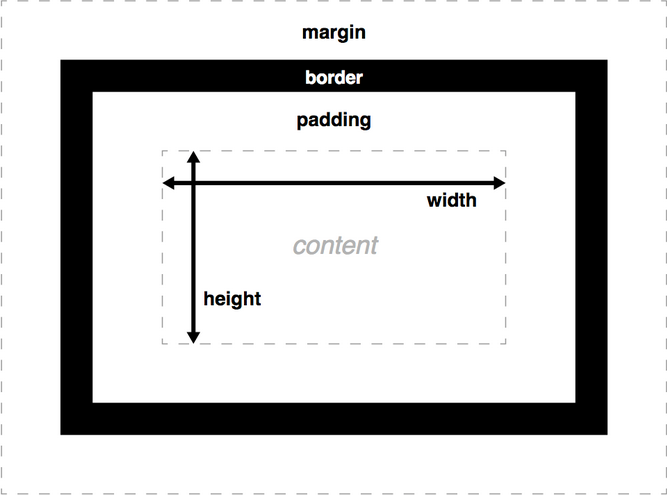

# CSS Box Model
- Every element within a document is structured as a rectangular box inside the document layout, the size and "onion layers" of which can be tweaked using some specific CSS properties. The relevant properties are as follows

