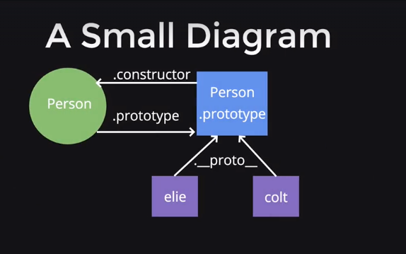
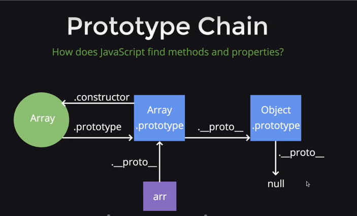

# Prototype in JavaScript


- Every constructor function has a property
on it called 'prototype', which is an object.
- The prototype object has a property on it called
'constructor', which points back to the constructor
function.
- Anytime an object is created using the 'new' keyword, a
property called '__proto__' gets created, linking the object
and the prototype property of the constructor function.
-To share properties and methods for objects created
by a constructor function, place them in the prototype as
it is the most efficient.

```javascript
// This is the constructor function

function Person(name){
	this.name = name;
}

// This is an object created from the Person constructor

var elie = new Person('Elie');
var colt = new Person('Colt');

// Since we used the new keyboard, we have established
// a link between the object and the prototype property
// we can access that using __proto__

elie.__proto__ === Person.prototype // true
colt.__proto__ === Person.prototype // true

// The person.prototype object also has a property
// called constructor which points back to the function

Person.prototype.constructor === Person // true
```
- Place the functions or properties that you want to share in the   
**prototype** of the constructor function 

```javascript
function Vehicle(make, model, year) {
	this.make = make;
	this.model = model;
	this.year = year;
	this.isRunning = false;
}
/* Since all the vehicles has the same functionality of
 method It should be placed on the 'prototype' property
 instead of placing it independently while it just
 does the same thing.
*/ 

Vehicle.prototype.turnOn = function() {
	this.isRunning = true;
}

Vehicle.prototype.turnOff = function() {
	this.isRunning = false;
}

Vehicle.prototype.honk = function() {
	if (this.isRunning) {
		return 'Beep';
	}

	return 'Turn on the vehicle first.'
}
```

### Prototype Chain

- JavaScript find methods and properties through the prototype
chain of the objects.
- If JavaScript can't find the method that you invoked, it goes
through another ```___proto___``` until it reaches null.