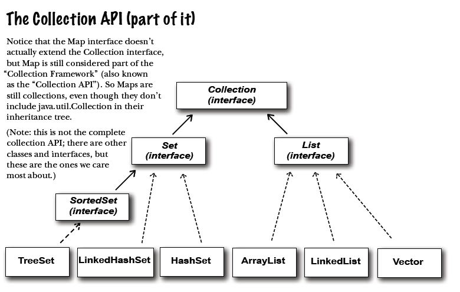
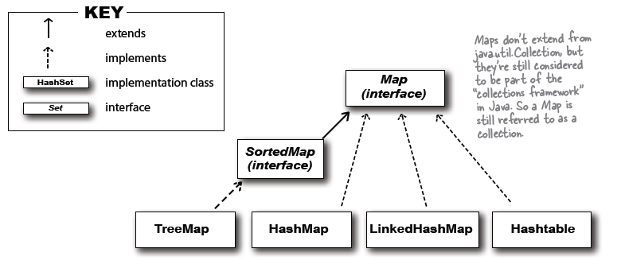

# Collections

## Interface

#### List (When sequence matters)
- Collections that know about the index position.
- Lists know where something is in the list. You can have more than one element referencing the same object.

#### Set (When uniqueness matters)
- Collections that do not allow duplicates.
- Sets know wether something is already in the collection. You can never have more than one element referencing
the same object. ( or more than one element referencing two objects that are considered equal)

#### Map (When finding something by key matters)
- Collections that use key-value pairs.
- Maps know the value associated with a given key. You can have two keys that reference the same value, 
but you cannot have duplicate keys. Although keys are typically String names(so you can make name/value property list), 
a key can be any object.

## Classes

#### TreeSet
- Keeps the element sorted and prevents duplicate.

#### HashMap
- Lets you store and access elements as name/value pairs.

#### LinkedList
- Make it easy to create structures like stacks or queues.

#### HashSet
- Prevents duplicate in the collection, and given  an element, can find that element in the collection quickly.

#### LinkedHashMap
- Like a regular HashMap, except in can remember the order in which elements (name/value pair) were inserted, 
or it can be configured to remember the order in which elements were last accessed.

## Collection Diagram

