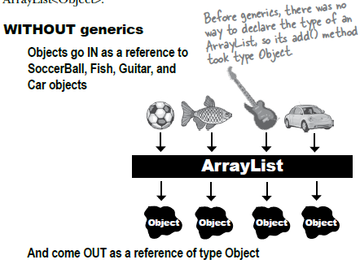
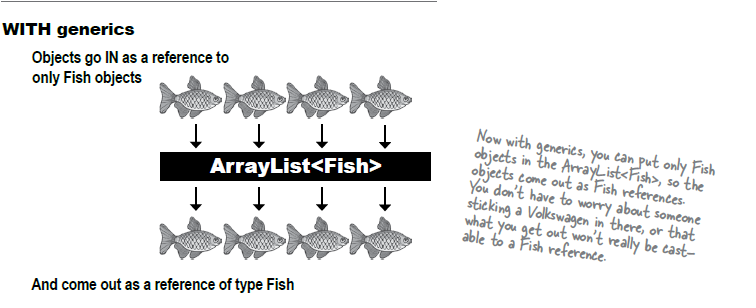

# Generics 

- Generic enables types (classes and interfaces) to be parameters when defining classes
- Generic provides more type safety
- Was introduced on Java 5.0

**Example**
```java
List dogs = new List();
dogs.add(new Dog());
dogs.add(new Cat());
dogs.add(new Giraffe());

// A list of dogs could contain cats and giraffe without generics.
```
The example above is not using any generics. So there are no type safety checks and a List of dogs can include a cat, and a giraffe object. As if it were accepting an object of type Object.

```java
List<Dog> dogs = new List<>();
dogs.add(new Cat()); // compile time error!
dogs.add(new Giraffe()); // compile time error!

//With generics a list of Dog can only accept a Dog object
```
The example above now use generics. It produces error at compile time since the List of dogs can only contain of type Dog object.

**Diagram**



