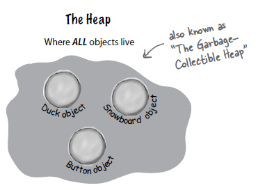
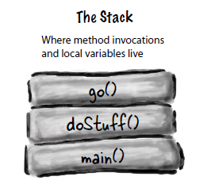
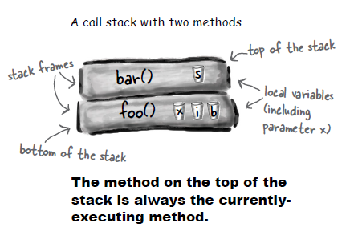
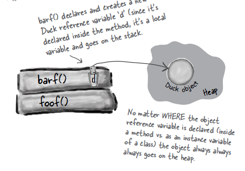

# Heap and Stack in Java
*All images here are from Head First Java book*

### Heap

- Also known as **garbage-collectible heap**
- Is a space in a memory where java objects live.
- Instance variables lives in the heap inside with the object they belong to.

### Stack

- Where method invocations and local variables live

- The method on the top of the stack is the method that is currently executing.
- A method stays on the stack until it hits its closing curly brace.

- If the local variable of a specific method is holding a reference variable. It only holds the reference not the actual object itself
