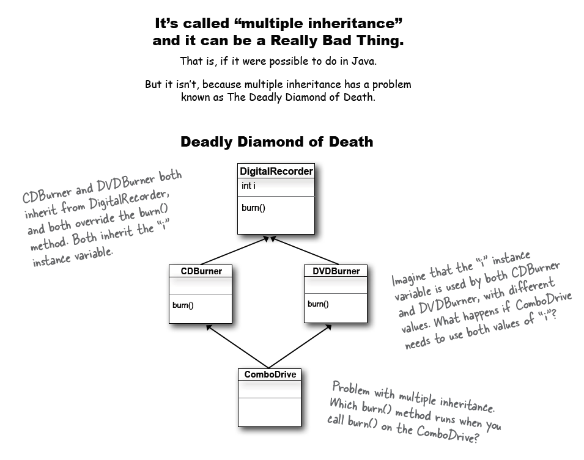

# Inheritance 
- Is the ability of a class to inherit states and methods from a particular class.
- Inheritance is a great feature in java to prevent code duplication from classes.

```java
public class Animal {
  int size;
  
  public void eat() {
  
  }
  
  public void sleep() {
  
  }
  
  public void roam() {
  
  }
  
  public void makeNoise() {
  
  }
}

public class Canine extends Animal{

}

public class Wolf extends Canine{

}
```
- In the code above the class illustrates inheritance, meaning all the class that extends the **Animal** class will inherit its properties and method. The **Canine** class will inherit the ```size``` property and the ```eat()```, ```sleep()```, ```roam()```, ```makeNoise()``` methods. Although **Wolf** class doesn't explicitly extends the **Animal** class but since the **Canine** class extends it, It will still inherit the specified properties and methods of the **Animal** class.

## IS-A and HAS-A
### IS-A Test
- To test if your inheritance tree make sense, use the **IS-A**  test. For example **Wolf** IS-A **Animal**, which make sense, but **Animal** IS-A **Wolf**, it doesn't really ring any bell.
- Inheritance works one way around and not the other way. (Ex. **Square** IS-A **Shape** true, **Shape** IS-A **Square** false)

### HAS-A Test
- HAS-A Test only works if the two classes are related, but not through inheritance. (Ex. **Bathroom** HAS-A **Tub** true, **Bathroom** IS-A **Tub**, wont make sense vice-versa. Bathroom class would have an instance variable of Tub).

## Deadly Diamond of Death (DDD)

- Java doesn't allow multiple inheritance on different superclasses.


