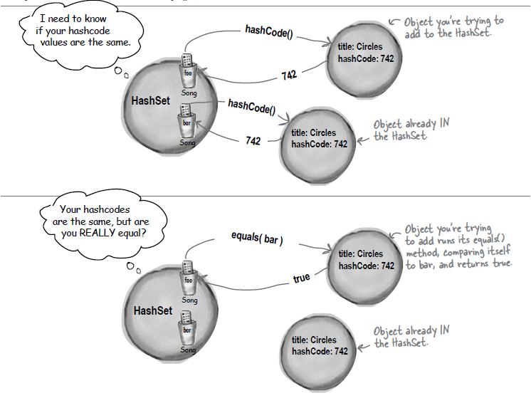

# Object Equality

### Reference equality
- Two references, one object on the heap.
- Two references that refer to the same object on the heap are equal.
 - use the ```==``` operator, if you want to know if two references are really refering to the same object, which (remember) compares the bits variables.

### Object equality
- Two references, two objects on the heap but the objects are considered meaningfully equal.
- If you want to treat objects as equal (for example you decided that Song objects can only be equal if they have a matching title variable) you must override both **equal()** and **hashCode()** methods inherited from class Object.



*This image is from Head First Java Book*

- The image above demonstrates why we should override both **equal()** and **hashCode()** method.

#### Examples
[Why do I need to override the equals and hashCode methods in Java?](https://stackoverflow.com/questions/2265503/why-do-i-need-to-override-the-equals-and-hashcode-methods-in-java)
