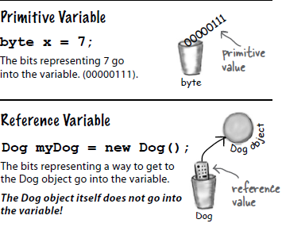

# Primitive variable and Reference variable

- Java is strictly typed

### Primitive variables

```java
// Primitive declarations and assignments
//Common used primitive variables
int x = 10;
double d = 5653.50
float = 655.2f
boolean isFound = false;
```

### Reference variables

```java
Dog dog = new Dog();
Cat cat = new Cat();

//using methods
dog.bark();
cat.meow();
```
- Reference variables doesn't hold the object itself, but it holds something like a pointer. Or an address. 
Except, In Java we don't really know what is inside a reference variable. We do know whatever it is, it represents 
one and only one object. And the JVM knows how to use the reference to get to the object.

### Diagram


- With primitive variables, the value of the variable is... the value (5, -26.7, 'a')
- With reference variables, the value of the variables is... bits representing a way to get to a specific object. The bits 
is only used for accessing an object.
